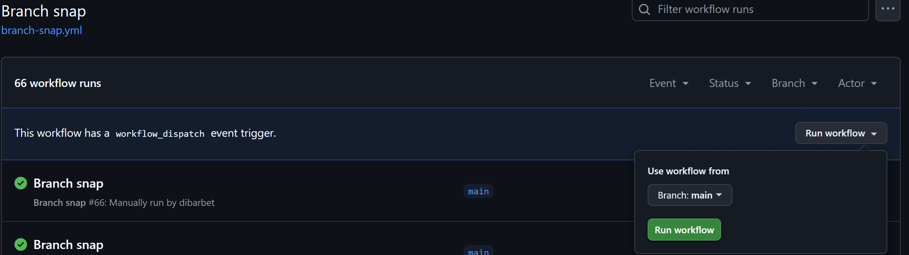
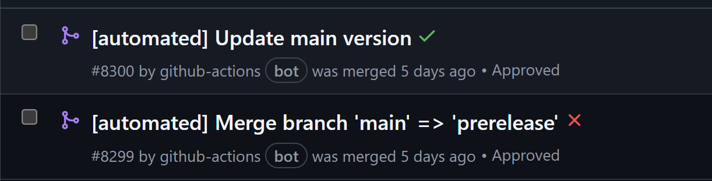
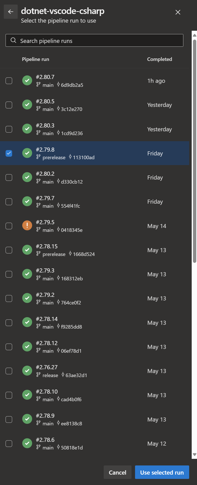
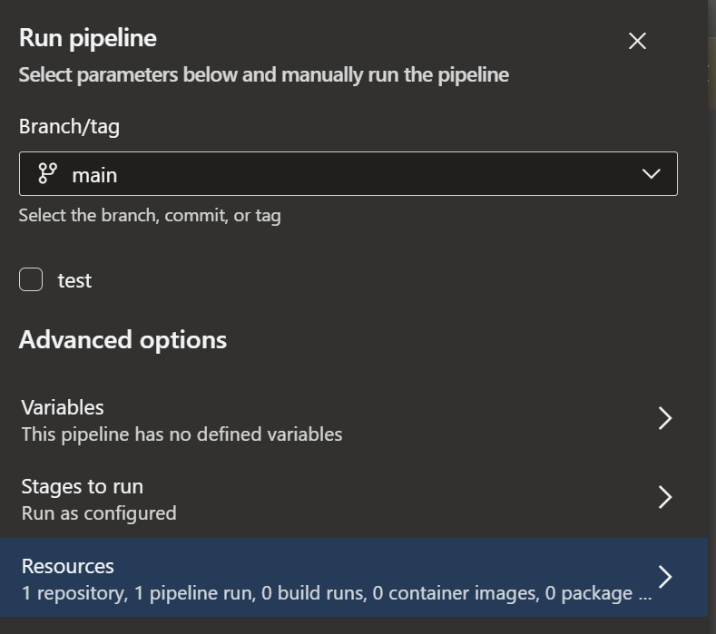

## Table of Contents

- [Setting Up Local Development Environment](#setting-up-local-development-environment)
  - [Prerequisites for Development](#prerequisites-for-development)
  - [Building, Running, and Testing the Repository](#building-running-and-testing-the-repository)
  - [Setting Up Local Language Servers](#setting-up-local-language-servers)
    - [Roslyn](#roslyn)
    - [Razor](#razor)
  - [Debugging Local Language Servers](#debugging-local-language-servers)
  - [Configuring Local Language Servers](#configuring-local-language-servers)
    - [Finding the `settings.json` file for your workspace](#finding-the-settingsjson-file-for-your-workspace)
    - [Configuring Roslyn Language Server](#configuring-roslyn-language-server)
    - [Configuring Razor Language Server](#configuring-razor-language-server)
- [Creating VSIX Packages for the Extension](#creating-vsix-packages-for-the-extension)
- [Updating the `Roslyn` Language Server Version](#updating-the-roslyn-language-server-version)
- [Snapping for releases](#snapping-for-releases)

## Setting Up Local Development Environment

Setting up your local development environment for the vscode-csharp repository involves several steps. This guide will walk you through the process.

### Prerequisites for Development

Before you start, make sure you have the following software installed on your machine:

* Node.js v22 ([22.17.0 LTS](https://nodejs.org/en/blog/release/v22.17.0)).
  * Note - Building with higher major versions of Node.js is not advised - it may work but we do not test it.
* Npm (The version shipped with node is fine)
* .NET 10.0 SDK (dotnet should be on your path)

Once you have these installed, you can navigate to the cloned vscode-csharp repository to proceed with building, running, and testing the repository.

### Building, Running, and Testing the Repository

Follow these steps to build, run, and test the repository:

#### Building

If you have the ability to run powershell, you can invoke "init.ps1" from the root of the repo. If not, the following steps will get build going for you as well:

1. Run `npm install -g vsts-npm-auth`, then run `vsts-npm-auth -config .npmrc` - This command will configure your credentials for the next command.
   a.  If you have already authenticated before, but the token expired, you may need to run `vsts-npm-auth -config .npmrc -f` instead.
2. Run `npm i` - This command installs the project dependencies.
3. Run `npm i -g gulp` - This command installs Gulp globally.
4. Run `gulp installDependencies` - This command downloads the various dependencies as specified by the version in the [package.json](package.json) file.

You can now run `code .` - This command opens the project in Visual Studio Code.

#### Running

After completing the build steps:

1. Run `npm run watch` (Optional) - This command watches for code changes.
2. Press <kbd>Ctrl+Shift+D</kbd> to open the Run view in VS Code and ensure `Launch Extension` is selected.
3. Start debugging by pressing <kbd>F5</kbd>.

#### Testing

To run all unit tests, execute `npm run test:unit`.
To run all integration tests execute `npm run test:integration`

To debug unit tests locally, press <kbd>F5</kbd> in VS Code with the "Launch Tests" debug configuration selected.

To debug integration tests
1.  Import the `csharp-test-profile.code-profile` in VSCode to setup a clean profile in which to run integration tests.  This must be imported at least once to use the launch configurations (ensure the extensions are updated in the profile).
2.  Open any integration test file and <kbd>F5</kbd> launch with the correct launch configuration selected.
    - For integration tests inside `test/lsptoolshost`, use either `[Roslyn] Run Current File Integration Test` or `[DevKit] Launch Current File Integration Tests` (to run tests using C# + C# Dev Kit)
    - For integration tests inside `test/razor`, use `[Razor] Run Current File Integration Test`
    - For integration tests inside `test/omnisharp`, use one of the `[O#] Run Current File Integration Test` current file profiles

These will allow you to actually debug the test, but the 'Razor integration tests' configuration does not.

### Setting Up Local Language Servers

This section shows how to set up local Razor or Roslyn language servers for debugging with the VSCode C# extension.

#### Roslyn

1. Clone the [Roslyn repository](https://github.com/dotnet/roslyn). This repository contains the Roslyn server implementation.
2. Follow the build instructions provided in the repository.

The server DLL is typically at `$roslynRepoRoot/artifacts/bin/Microsoft.CodeAnalysis.LanguageServer/Debug/net9.0/Microsoft.CodeAnalysis.LanguageServer.dll`, but this may vary based on the built configuration.

#### Razor

1. Clone the [Razor repository](https://github.com/dotnet/razor). This repository contains the Razor server implementation.
2. Follow the build instructions provided in the repository.

The extension is typically at `$razorRepoRoot/artifacts/bin/Microsoft.VisualStudioCode.RazorExtension/Debug/net9.0`.

### Debugging Local Language Servers

Before running the language servers, familiarize yourself with the steps in the [Configuring Local Language Servers](#configuring-local-language-servers) section to configure either the Roslyn or Razor language servers for debugging .

**Note**: You would only need to configure this for the workspace you wish to debug, NOT for the repo root of vscode-csharp repo.

Follow these steps to enable debugging:

1. Press `Ctrl+Shift+D` and then `F5` to launch the extension. This will open a new VS Code instance for `vscode-csharp` repo.
2. In the new VS Code instance, open the project or solution you want to debug.
3. Follow instructions in [Configuring Local Language Servers](#configuring-local-language-servers) to find and configure the workspace settings for the language server you want to debug.
4. Ensure the language server is fully built in Debug mode.
5. Meanwhile in a Visual Studio instance open the `.sln` solution file for the language server you want to debug. Keep this instance open for use in a later step.
6. Back on VS Code, press `Ctrl+Shift+P` and select `Reload Window`. This ensures the changes made in step 3 are applied.
7. After reloading, a window will pop up prompting you to select or open a Visual Studio instance. Now, select the instance you opened in step 5.
8. The language server will now trigger a breakpoint on `Debugger.Launch()` when it starts.

### Configuring Local Language Servers

This section provides instructions on how to debug locally built Roslyn and Razor language servers. You can do this by either directly editing the `settings.json` file of your workspace or through the VSCode settings interface.

#### Finding the `settings.json` file for your workspace
- Open the Command Palette with `Ctrl+Shift+P` (or `Cmd+Shift+P` on macOS)
- Type "Preferences: Open Workspace Settings"
- Select the option that appears.
- In the Workspace Settings tab, in the upper right corner, you'll see an icon that looks like a document with an arrow, which is the "Open Settings (JSON)" button.
- Click on this button to open the `settings.json` file.

#### Configuring Roslyn Language Server

Add the following lines to your `settings.json`. Replace `<roslynRepoRoot>` with the actual path to your Roslyn repository.

```json
"dotnet.server.waitForDebugger": true,
"dotnet.server.path": "<roslynRepoRoot>/artifacts/bin/Microsoft.CodeAnalysis.LanguageServer/Debug/net9.0/Microsoft.CodeAnalysis.LanguageServer.dll"
```

---

**If using C# Dev Kit**, you also need to override the Roslyn DevKit component in your `settings.json`. This step is not necessary if you are not loading the Dev Kit extension.
```json
"dotnet.server.componentPaths": {
    "roslynDevKit": "<roslynRepoRoot>/artifacts/bin/Microsoft.VisualStudio.LanguageServices.DevKit/Debug/net9.0"
},
```

---

Or, in VSCode settings (`Ctrl+,`):

1. Search for `dotnet server`.
2. Set `dotnet.server.path` to the path of your Roslyn DLL.
3. Enable `dotnet.server.waitForDebugger`.
4. (Optional) - add the component to `dotnet.server.componentPaths` (see above).

#### Configuring Razor Language Server

Add the following lines to your `settings.json`. Replace `<razorRepoRoot>` with the actual path to your Razor repository.

```json
"dotnet.server.componentPaths": {
    "razorExtension": "<razorRepoRoot>/artifacts/bin/Microsoft.VisualStudioCode.RazorExtension/Debug/net9.0"
},
```

### Updating NPM packages
We use the .NET eng AzDo artifacts feed https://dnceng.pkgs.visualstudio.com/public/_packaging/dotnet-public-npm/npm/registry/ with upstreams to the public npm registry.
Auth is required in order to pull new packages from the upstream.  This can be done by running `vsts-npm-auth -config .npmrc`.
If you need to renew authorization, you can force it via `vsts-npm-auth -config .npmrc -F`

## Creating VSIX Packages for the Extension

To package this extension, we need to create VSIX Packages. The VSIX packages can be created using the gulp command `gulp vsix:release:package`. This will create all the platform specific VSIXs that you can then install manually in VSCode.

## Updating the `Roslyn` Language Server Version

In order to pull in new packages from upstreams into the msft_consumption feed we use for restoring, you will need to be a member of the 'CSharp VS Code Extension contributors' group in the [Azure Devops instance](https://dev.azure.com/azure-public/vside/_settings/teams).

To update the version of the roslyn server used by the extension do the following:
1.  Find the the Roslyn signed build you want from [here](https://dnceng.visualstudio.com/internal/_build?definitionId=327&_a=summary).  Typically the latest successful build of main is fine.
2.  In the official build stage, look for the `Publish Assets` step.  In there you will see it publishing the `Microsoft.CodeAnalysis.LanguageServer.neutral` package with some version, e.g. `4.6.0-3.23158.4`.  Take note of that version number.
3.  In the [package.json](package.json) inside the `defaults` section update the `roslyn` key to point to the version number you found above in step 2.
4.  Ensure that version of the package is in the proper feeds by running `gulp updateRoslynVersion`. Note: you may need to install the [Azure Artifacts NuGet Credential Provider](https://github.com/microsoft/artifacts-credprovider#installation-on-windows) to run interactive authentication.
5.  Build and test the change. If everything looks good, submit a PR.

## Updating the `Roslyn` Copilot Language Server version

In order to pull in the latest version of Roslyn Copilot bits from the VS Conversations repo, follow these steps:
1. Trigger [this pipeline](https://devdiv.visualstudio.com/DevDiv/_build?definitionId=27222) which should automatically publish bits to the storage account and then create an insertion PR like [this](https://github.com/dotnet/vscode-csharp/pull/8597)
2. Build and test the change to ensure the roslyn copilot language server bits are downloaded correctly. You'll see log entries like the below in the Output->C# pane:
```
[info] Installing package 'Language server for Roslyn Copilot integration'
[info] Finished
```
More details for this are [here] (https://devdiv.visualstudio.com/DevDiv/_git/VisualStudio.Conversations?path=/src/Copilot.Roslyn.LanguageServer/README.md)

## Snapping for releases
Extension releases on the marketplace are done from the prerelease and release branches (corresponding to the prerelease or release version of the extension).  Code flows from main -> prerelease -> release.  Every week we snap main -> prerelease.  Monthly, we snap prerelease -> release.

### Versioning Scheme
The extension follows a specific versioning scheme for releases:
- **Prerelease versions**: Use standard minor version increments (e.g., 2.74, 2.75, 2.76...)
- **Stable release versions**: Use the next tens version (e.g., 2.74 prerelease becomes 2.80 stable)
- **Main branch after RC snap**: Jumps to one above the next stable version (e.g., if snapping 2.74 as RC, main becomes 2.81)

### Snap main -> prerelease
The snap is done via the "Branch snap" github action.  To run the snap from main -> prerelease, run the action via "Run workflow" and choose main as the base branch.


When running the snap action, you can optionally check the "Is this a release candidate snap" checkbox. If checked:
- The prerelease branch will receive the snapped code with the current version (e.g., 2.74)
- The main branch version will be updated to be higher than the next stable release (e.g., 2.81, since the next stable would be 2.80)

This will generate two PRs that must be merged.  One merging the main branch into prerelease, and the other bumps the version in main.


### Snap prerelease -> release
To snap from prerelease to release, run the same action but use **prerelease** as the workflow branch.  This will generate a PR merging from prerelease to release, and automatically update the version to the next stable release version (e.g., 2.74 -> 2.80) on the merge branch before the PR is merged.

### Marketplace release
The marketplace release is managed by an internal AzDo pipeline.  On the pipeline page, hit run pipeline.  This will bring up the pipeline parameters to fill out:
1.  The branch will **always** be main, no matter if release a build from prerelease or release.
2.  Uncheck the "test" option.
3.  In "Resources", choose "dotnet-vscode-csharp [officialBuildCI]", then check only the build that should be released, and then confirm with "Use selected run".  Based on the selected build, it will automatically determine if it is prerelease or release. 
4.  The pipeline parameters should then look something like the following image.  Hit "Run". 
5.  After a bit, the pipeline will request approval from an authorized approver before it actually uploads to the marketplace.  Hit approve and it will continue.
