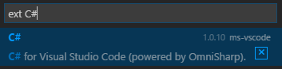

## Legacy OmniSharp Support for Visual Studio Code

This is the original OmniSharp extension which provided the C# editing support that was previously bundled with Visual Studio Code.

For most scenarios, such as development on Windows and [.NET Core RC2](https://www.microsoft.com/net/core/platform) on OS X and Linux, you should use the latest [C# extension for Visual Studio Code](https://marketplace.visualstudio.com/items?itemName=ms-vscode.csharp). However, support for Unity and Xamarin, and other .csproj-based projects has been temporarily disabled for OS X and Linux. Rest assured that this will be restored in the near future!

In the meantime, you can install and use this the Legacy OmniSharp extension to enjoy a great C# editing experience on OS X and Linux for .csproj-based projects, such as Unity and Xamarin.

**Please note the following important details before installing this extension:**

1. You should only use this extension on OS X and Linux if you are developing on .csproj projects. The C# extension officially supports .csproj projects on Windows. Also, if you are doing .NET Core development on Windows, OS X or Linux, the C# extension is the appropriate choice. 

2. If you already have the C# extension installed, you will need to uninstall before installing the Legacy OmniSharp extension with the following steps:
    * In Visual Studio Code, press Ctrl+P to launch VS Code Quick Open
    * Type Quick Open, type `ext C#` to find the installed C# extension:
    
      
      
    * Click the [X] to the right of the C# extension.
    * Allow Visual Studio Code to restart. 
    
3. This extension has a dependency on Mono >= 4.0.1.

4. This extension can be used to target ASP.NET 5 RC1 and older DNX-based projects. If you need to install ASP.NET 5 RC1, you can still find it in the following locations:
    * Windows: https://docs.asp.net/en/1.0.0-rc1/getting-started/installing-on-windows.html
    * OS X: https://docs.asp.net/en/1.0.0-rc1/getting-started/installing-on-mac.html. (Be sure to follow the instructions for using Mono.)
    * Linux: https://docs.asp.net/en/1.0.0-rc1/getting-started/installing-on-linux.html. (Be sure to follow the instructions for using Mono.)