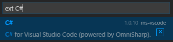

## C# for Visual Studio Code
A [Visual Studio Code](https://code.visualstudio.com/) [extension](https://marketplace.visualstudio.com/VSCode) that provides rich language support for C# and is shipped along with [C# Dev Kit][csdevkitextension]. Powered by a Language Server Protocol (LSP) server, this extension integrates with open source components like [Roslyn](https://github.com/dotnet/roslyn) and [Razor](https://github.com/dotnet/razor) to provide rich type information and a faster, more reliable C# experience.

## Recommended Install
While it is possible to use the C# extension as a standalone extension, we highly recommend using [C# Dev Kit][csdevkitextension].

1. Installing [C# Dev Kit][csdevkitextension] will automatically install this extension as a required dependency.
2. Open a folder/workspace that contains a C# project (.csproj) and a C# solution (.sln/.slnx) and the extension will activate.
3. Whether you install C# Dev Kit or just the C# extension, the [.NET Install Tool](https://marketplace.visualstudio.com/items?itemName=ms-dotnettools.vscode-dotnet-runtime) will be installed as a dependency.

Note: If working on a solution that requires versions prior to .NET 6 or non-solution based projects, install a .NET Framework runtime and [MSBuild tooling](https://visualstudio.microsoft.com/downloads/#build-tools-for-visual-studio-2022).
  * Set omnisharp.useModernNet to false and set dotnet.server.useOmnisharp to true
  * Uninstall or disable C# Dev Kit
  * Windows: .NET Framework along with [MSBuild Tools](https://visualstudio.microsoft.com/downloads/#build-tools-for-visual-studio-2022)
  * MacOS/Linux: [Mono with MSBuild](https://www.mono-project.com/download/preview/)

## Features
Learn more about the rich features of the C# extension:
  * [Refactoring](https://code.visualstudio.com/docs/csharp/refactoring): Edit your code with code fixes and refactorings
  * [Navigation](https://code.visualstudio.com/docs/csharp/navigate-edit): Explore and navigate your code with features like Go To Definition and Find All References
  * [IntelliSense](https://code.visualstudio.com/docs/csharp/navigate-edit): Write code with auto-completion
  * [Formatting and Linting](https://code.visualstudio.com/docs/csharp/formatting-linting): Format and lint your code

For more information you can:

- [Follow our C# tutorial](https://code.visualstudio.com/docs/csharp/get-started) with step-by-step instructions for building a simple app.
- Check out the [C# documentation](https://code.visualstudio.com/docs/languages/csharp) on the VS Code site for general information about using the extension.

## How to use OmniSharp?
If you don’t want to take advantage of the great Language Server features, you can revert back to using OmniSharp by going to the Extension settings and setting `dotnet.server.useOmnisharp` to true. Next, uninstall or disable C# Dev Kit. Finally, restart VS Code for this to take effect.

## Found a Bug?
To file a new issue, follow the instructions at https://github.com/dotnet/vscode-csharp/blob/main/SUPPORT.md.

## Contributing

### License

Copyright © .NET Foundation, and contributors.

The Microsoft C# extension is subject to [these license terms](https://github.com/dotnet/vscode-csharp/blob/main/RuntimeLicenses/license.txt).
The source code to this extension is available on [https://github.com/dotnet/vscode-csharp](https://github.com/dotnet/vscode-csharp) and licensed under the [MIT license](LICENSE.txt).

### Contribution License Agreement

By signing the [CLA](https://cla.dotnetfoundation.org/), the community is free to use your contribution to [.NET Foundation](http://www.dotnetfoundation.org) projects.

### .NET Foundation

This project is supported by the [.NET Foundation](http://www.dotnetfoundation.org).

## Feedback

<!-- 
[FAQs]
Check out the FAQs before filing a question. 
-->

[Provide feedback](https://github.com/dotnet/vscode-csharp/issues)
File questions, issues, or feature requests for the extension.

[Known issues](https://github.com/dotnet/vscode-csharp/issues)
If someone has already filed an issue that encompasses your feedback, please leave a 👍 or 👎 reaction on the issue to upvote or downvote it to help us prioritize the issue.

[Quick survey](https://www.research.net/r/8KGJ9V8?o=[o_value]&v=[v_value]&m=[m_value])
Let us know what you think of the extension by taking the quick survey.

[csdevkitextension]: https://marketplace.visualstudio.com/items?itemName=ms-dotnettools.csdevkit
## Legacy OmniSharp Support for Visual Studio Code

This is the original OmniSharp extension which provided the C# editing support that was previously bundled with Visual Studio Code.

For most scenarios, such as development on Windows and [.NET Core RC2](https://www.microsoft.com/net/core/platform) on OS X and Linux, you should use the latest [C# extension for Visual Studio Code](https://marketplace.visualstudio.com/items?itemName=ms-vscode.csharp). However, support for Unity and Xamarin, and other .csproj-based projects has been temporarily disabled for OS X and Linux. Rest assured that this will be restored in the near future!

In the meantime, you can install and use this the Legacy OmniSharp extension to enjoy a great C# editing experience on OS X and Linux for .csproj-based projects, such as Unity and Xamarin.

**Please note the following important details before installing this extension:**

1. You should only use this extension on OS X and Linux if you are developing on .csproj projects. The C# extension officially supports .csproj projects on Windows. Also, if you are doing .NET Core development on Windows, OS X or Linux, the C# extension is the appropriate choice. 

2. If you already have the C# extension installed, you will need to uninstall before installing the Legacy OmniSharp extension with the following steps:
    * In Visual Studio Code, press Ctrl+P to launch VS Code Quick Open
    * Type Quick Open, type `ext C#` to find the installed C# extension:
    
      
      
    * Click the [X] to the right of the C# extension.
    * Allow Visual Studio Code to restart. 
    
3. This extension has a dependency on Mono >= 4.0.1.

4. This extension can be used to target ASP.NET 5 RC1 and older DNX-based projects. If you need to install ASP.NET 5 RC1, you can still find it in the following locations:
    * Windows: https://docs.asp.net/en/1.0.0-rc1/getting-started/installing-on-windows.html
    * OS X: https://docs.asp.net/en/1.0.0-rc1/getting-started/installing-on-mac.html. (Be sure to follow the instructions for using Mono.)
    * Linux: https://docs.asp.net/en/1.0.0-rc1/getting-started/installing-on-linux.html. (Be sure to follow the instructions for using Mono.)
