# Support

## How to get help

This project uses GitHub Issues to track bugs and feature requests. Please search the [existing issues](https://github.com/dotnet/vscode-csharp/issues) before filing new issues to avoid duplicates. For new issues, file your bug or feature request as a new Issue.

This repository tracks issues related to the C# extension.  Any issues related to the C# editing experience, Roslyn language server and other basic C# functionality should be filed here (regardless of if you're using C# Dev Kit or not).

For C# Dev Kit only features such as the Solution Explorer, Test Window, etc, please see https://github.com/microsoft/vscode-dotnettools/blob/main/SUPPORT.md

For help and questions about using this project, please see the [README](https://github.com/dotnet/vscode-csharp/blob/main/README.md).

### How to file an issue

We highly recommend using the C# extension's built-in command, `CSharp: Report an issue` (`csharp.reportIssue`) to create a pre-filled issue template.  This will include helpful details such as local dotnet installations, installed extensions, and other information.

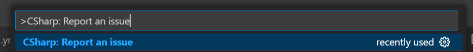

#### Capturing activity trace logging

When investigating issues, the C# extension provides a command to capture trace-level logs while you reproduce the issue. This is the recommended way to collect logs as it automatically captures all relevant log files in a single archive.

1. **Invoke the Capture Logs Command**:
   - Open the Command Palette (`Ctrl+Shift+P` or `Cmd+Shift+P` on macOS).
   - Search for and select `CSharp: Capture Logs` (`csharp.captureLogs`).  
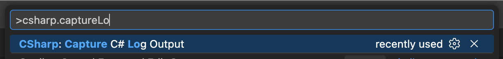
2. **Reproduce the Issue**:
   - A notification will appear indicating that logs are being captured.
   - While the notification is visible, perform the actions that reproduce the issue.
   - The extension automatically sets the log level to `Trace` during capture to collect detailed information.

3. **Stop Capturing and Save**:
   - Click the `Cancel` button on the notification to stop capturing.
   - You will be prompted to save the log archive. Choose a location to save the `.zip` file.

4. **Share the Logs**:
   - The saved archive contains:
     - `csharp.log` - The existing C# log file
     - `csharp-lsp-trace.log` - The existing LSP trace log file
     - `csharp.activity.log` - Captured C# log activity during the recording session
     - `csharp-lsp-trace.activity.log` - Captured LSP trace activity during the recording session
     - `csharp-settings.json` - Current C# extension settings
   - Attach the archive to your GitHub issue or share it privately (see [Sharing information privately](#sharing-information-privately)).

> [!WARNING]
> The logs may contain file paths, project names, and other workspace information. Review the contents before sharing publicly.

##### Setting Trace Levels Manually

If you need to set the trace level manually:

- **In the C# output window** (`View` -> `Output`), set the log level to `Trace`.
  
  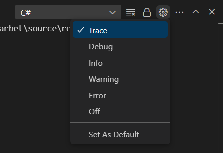

- **In the C# LSP Trace Logs output window**, set the log level to `Trace`.

**Other Ways to Set the Log Level**:
- When launching VS Code from the CLI, pass the `--log ms-dotnettools.csharp:trace` parameter.
- Invoke the `Developer: Set Log Level` command from the VS Code command palette, find the `C#` entry, and set the level.

#### Collecting Razor Logs
For issues with Razor, the Razor Log output window can contain useful information.

1. **Set the Log Level to Trace**:
   - Open the `Razor Logs` output window (`View` -> `Output`).
   - Set the log level to `Trace`.

     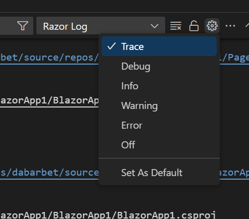

2. **Reproduce the Issue**:
   - Perform the actions that reproduce the issue.

3. **Copy the Logs**:
   - Select all contents of the window (e.g., `Ctrl+A`) and paste them into the GitHub issue when requested.

4. **Reset the Log Level**:
   - Once the logs are collected, reset the log level to `Info`.

### Project Loading Problems

Missing language features are often caused by a failure to load the project(s) or solution. To diagnose and resolve these issues, follow these steps:

1. **Provide General Logs**:
   - Include the information from the issue template and the general logs (see the "Capturing activity trace logging" section above). These logs are essential for troubleshooting.

2. **Check the Active Project Context**:
   - Verify that the file is associated with the correct project in the language server.
   - This information is displayed in the bottom-right corner of the VSCode window in the language status section.
   - You can pin this item using the pin icon to keep it visible at all times.

     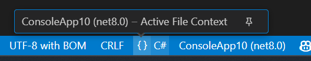

3. **Verify the Solution Explorer (C# Dev Kit)**:
   - If you are using C# Dev Kit, check the Solution Explorer to ensure the project is displayed with the expected references.
   - If the references or structure are not as expected, include the contents of the `Projects` output window in your issue report.

### Colorization problems
If you encounter issues with document classification (e.g., incorrect syntax highlighting or colorization), please provide the following information to help us diagnose the problem:

1. **Theme in Use**:
   - Specify the name of the theme you are currently using in VSCode (e.g., "Dark+", "Light+", or a custom theme).

2. **Tokens and Scope Information**:
   - The `Developer: Inspect Editor Tokens and Scopes` command shows information about the problematic word or section:
     1. Open the Command Palette (`Ctrl+Shift+P` or `Cmd+Shift+P` on macOS).
     2. Search for and select `Developer: Inspect Editor Tokens and Scopes` (`editor.action.inspectTMScopes`).
     3. Click on the word or section with incorrect colorization to display the token and scope information.
   - Take a screenshot of the output and include it in your issue report.

     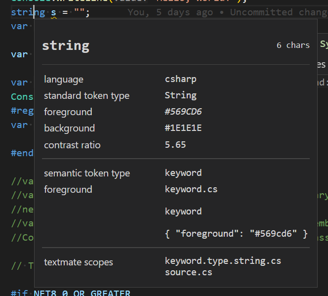

### Diagnostics problems

For issues with diagnostics, please provide values of the background analysis scope options, `dotnet.backgroundAnalysis.analyzerDiagnosticsScope` and `dotnet.backgroundAnalysis.compilerDiagnosticsScope`

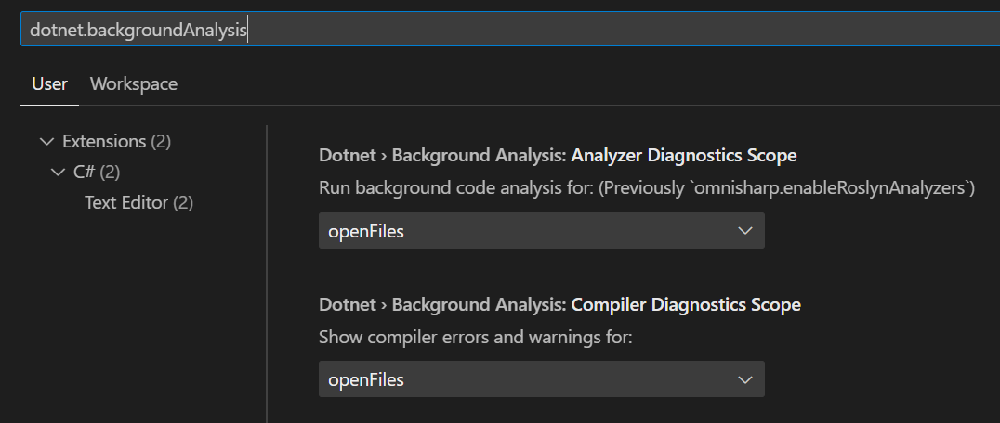

### Language server crashing

If the language server crashes, general logs are often helpful for diagnosing the issue. However, in some cases, logs alone may not provide enough information and we may need a crash dump. Follow these steps to collect a crash dump:
- Set the `dotnet.server.crashDumpPath` setting in VSCode to a user-writable folder where crash dumps can be saved.
- Reproduce the issue
- When the server crashes, a dump in the specified folder will be created.

> [!WARNING]
> The dump will contain detailed information about the workspace.  See [Sharing information privately](#sharing-information-privately)

### Recording a language server trace

When investigating performance issues, we may request a performance trace of the language server to diagnose what is causing the problem.  These are typically taken via [dotnet-trace](https://learn.microsoft.com/en-us/dotnet/core/diagnostics/dotnet-trace) (a cross platform tool to collect performance traces of .NET processes)

The C# extension has a built in command, `csharp.recordLanguageServerTrace` to help with trace collection.  This command will install `dotnet-trace` as a global tool, invoke it against the language server, and package the results along with logs into a `.zip` archive.

1.  Invoke the record language server trace command.  
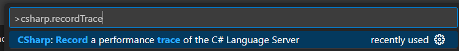
2.  Accept the default trace arguments, or change them if requested.  
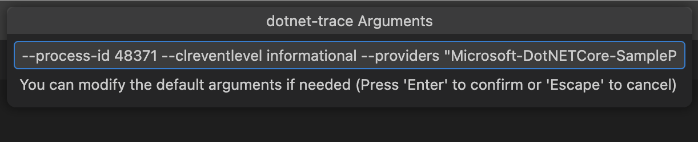
3.  Optionally select dump(s) to capture before and after the trace (Memory Dump and/or GC Dump). This is useful for comparing memory state before and after the trace.  
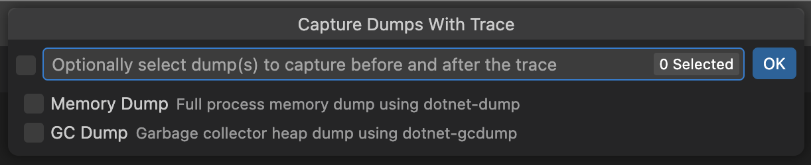
4.  If any dumps are selected, you will be prompted to customize the dump arguments.  
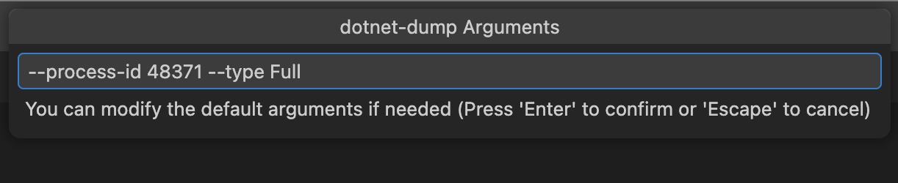
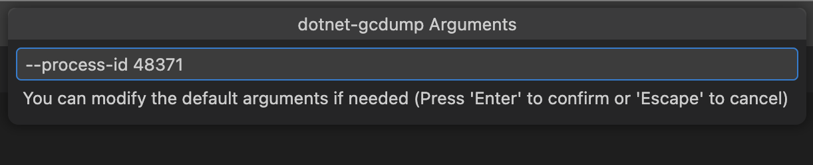
5.  Choose a location to save the trace archive (`.zip` file).
6.  A new terminal window will open to run the trace collection.  While the trace is running, reproduce the performance issue.  When done, hit <Enter> or <Ctrl+C> in the trace window to stop the trace, or click `Cancel` on the progress notification.  
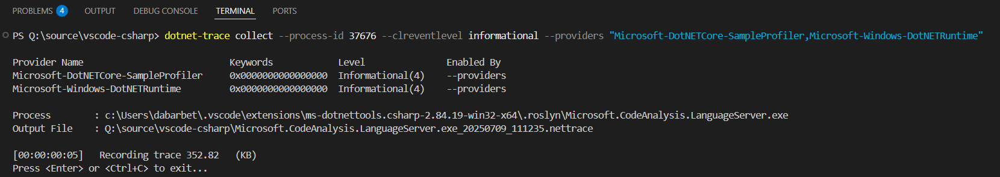
7.  The extension will automatically package the trace, logs, and any dumps into an archive.
8.  Attach the archive to your GitHub issue or share it privately (see [Sharing information privately](#sharing-information-privately)).

The saved archive contains:
- The `.nettrace` file from dotnet-trace
- `csharp.log` - The existing C# log file
- `csharp-lsp-trace.log` - The existing LSP trace log file
- `csharp.activity.log` - Captured C# log activity during the trace session
- `csharp-lsp-trace.activity.log` - Captured LSP trace activity during the trace session
- `csharp-settings.json` - Current C# extension settings
- Any memory dumps (`.dmp`) or GC dumps (`.gcdump`) captured before/after the trace

> [!WARNING]
> The trace and logs will contain detailed information about the workspace.  See [Sharing information privately](#sharing-information-privately)

### Collecting a dump

When investigating memory issues or hangs, we may request a dump of the language server. There are two types of dumps available:

- **Memory Dump**: A full process memory dump collected via [dotnet-dump](https://learn.microsoft.com/en-us/dotnet/core/diagnostics/dotnet-dump). Use this for investigating hangs or detailed memory analysis.
- **GC Dump**: A garbage collector heap dump collected via [dotnet-gcdump](https://learn.microsoft.com/en-us/dotnet/core/diagnostics/dotnet-gcdump). These are smaller than full memory dumps and focus on managed heap information. Use this for investigating memory leaks or object retention issues.

The C# extension has a built in command, `csharp.collectDump` to help with dump collection. This command will install the necessary dotnet tools, invoke them against the language server, and package the result into a `.zip` archive.

1.  Invoke the collect dump command by opening the Command Palette (`Ctrl+Shift+P` or `Cmd+Shift+P` on macOS) and selecting `CSharp: Collect a dump of the C# Language Server`.  
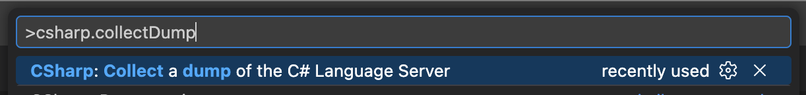
2.  Select which dumps to collect (Memory Dump and/or GC Dump). The archive will also include current C# extension log files and settings.  

3.  You will be prompted to customize the dump arguments.  

4.  Choose a location to save the archive (`.zip` file).
5.  The extension will collect the selected content and package it into an archive.
6.  Attach the archive to your GitHub issue or share it privately (see [Sharing information privately](#sharing-information-privately)).

> [!WARNING]
> Dumps will contain detailed information about the workspace, including file contents loaded in memory. See [Sharing information privately](#sharing-information-privately)

### Sharing information privately
Detailed logs, dumps, traces, and other information can sometimes contain private information that you do not wish to share publicly on GitHub (for example file paths and file contents).  Instead, you can utilize the Developer Community page to share these privately to Microsoft.

1.  Go to https://developercommunity.visualstudio.com/dotnet/report
2.  Fill in the issue title, reference the GitHub issue in the description, and upload the attachments.  Note that there is a 2 GB limit on attached files.  Dumps can often be larger than that, so we recommend compressing them to a `.zip` before uploading.

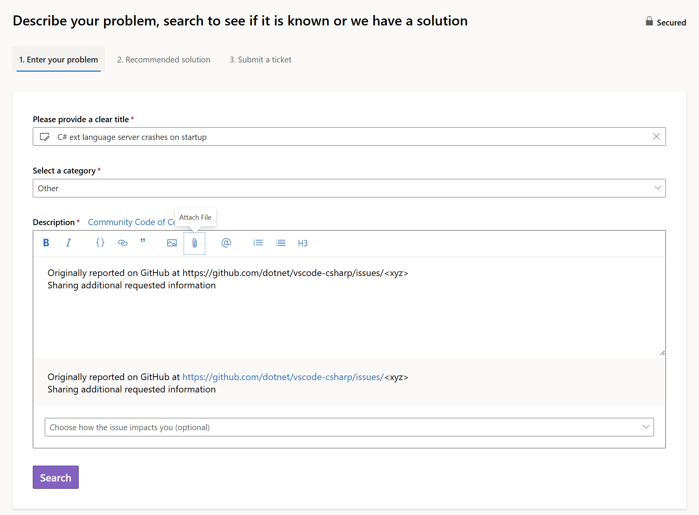
4.  Once created, a comment on the GitHub issue a link to the new Developer Community ticket.

## Microsoft Support Policy

Support for this project is limited to the resources listed above.
