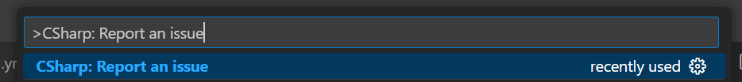
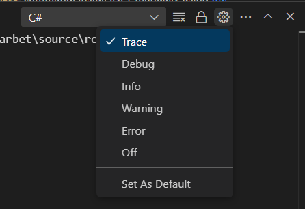
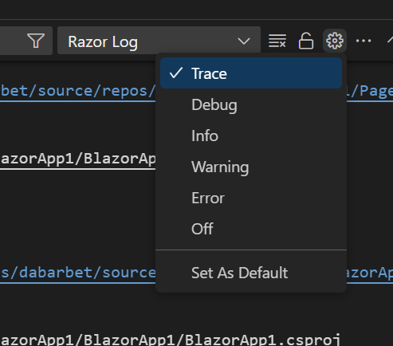
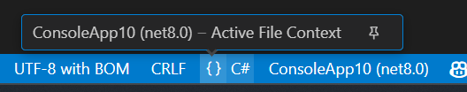
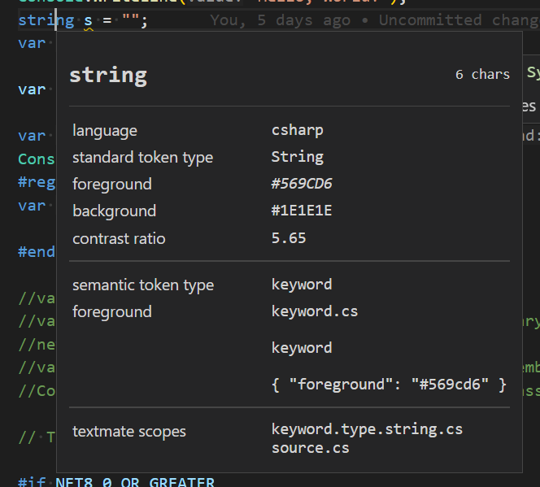
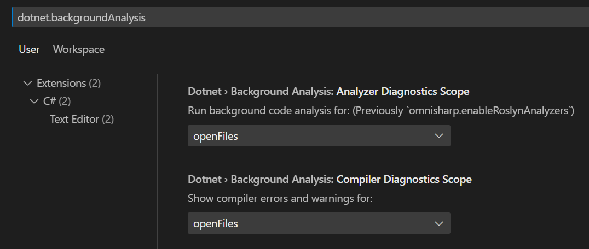

# Support

## How to get help

This project uses GitHub Issues to track bugs and feature requests. Please search the [existing issues](https://github.com/dotnet/vscode-csharp/issues) before filing new issues to avoid duplicates. For new issues, file your bug or feature request as a new Issue.

This repository tracks issues related to the C# extension.  Any issues related to the C# editing experience, Roslyn language server and other basic C# functionality should be filed here (regardless of if you're using C# Dev Kit or not).

For C# Dev Kit only features such as the Solution Explorer, Test Window, etc, please see https://github.com/microsoft/vscode-dotnettools/blob/main/SUPPORT.md

For help and questions about using this project, please see the [README](https://github.com/dotnet/vscode-csharp/blob/main/README.md).

### How to file an issue

We highly recommend using the C# extension's built-in command, `CSharp: Report an issue` (`csharp.reportIssue`) to create a pre-filled issue template.  This will include helpful details such as local dotnet installations, installed extensions, and other information.

#### Collecting General Logs

The template has a section to include the `C#` output window logs. These logs are not automatically included as they may contain personal information (such as full file paths and project names), but they are key to resolving problems.

1. **Set the Log Level to Trace**:
   - Open the `C#` output window (`View` -> `Output`).
   - Set the log level to `Trace`.
     
     

2. **Reproduce the Issue**:
   - Perform the actions that reproduce the issue.

3. **Copy the Logs**:
   - In the `C#` output window, select all the logs (e.g., `Ctrl+A`) and copy them.
   - Paste the logs into the issue template under the "C# Log" section.
   - If necessary, redact sensitive information (e.g., file paths, project names).

4. **Reset the Log Level**:
   - After collecting the logs, reset the log level to `Info`.

**Note**: If the issue occurs during extension startup, you can set `Trace` as the default log level, restart VSCode, and the trace logs will be captured automatically.

##### C# LSP Trace Logs
- To capture detailed requests sent to the Roslyn language server:
  1. Set the `C#` output window log level to `Trace` (as described above).
  2. Open the `C# LSP Trace Logs` output window.
  3. Reproduce the issue.
  4. Copy the contents of the `C# LSP Trace Logs` output window.

##### Other Ways to Set the Log Level
1. When launching VSCode from the CLI, pass the `--log ms-dotnettools.csharp:trace` parameter.
2. Invoke the `Developer: Set Log Level` command from the VSCode command palette, find the `C#` entry, and set the level.

#### Collecting Razor Logs
For issues with Razor, the Razor Log output window can contain useful information.

1. **Set the Log Level to Trace**:
   - Open the `Razor Logs` output window (`View` -> `Output`).
   - Set the log level to `Trace`.
     
     

2. **Reproduce the Issue**:
   - Perform the actions that reproduce the issue.

3. **Copy the Logs**:
   - Select all contents of the window (e.g., `Ctrl+A`) and paste them into the GitHub issue when requested.

4. **Reset the Log Level**:
   - Once the logs are collected, reset the log level to `Info`.

#### Project Loading Problems

Missing language features are often caused by a failure to load the project(s) or solution. To diagnose and resolve these issues, follow these steps:

1. **Provide General Logs**:
   - Include the information from the issue template and the general logs (see the "Collecting General Logs" section above). These logs are essential for troubleshooting.

2. **Check the Active Project Context**:
   - Verify that the file is associated with the correct project in the language server.
   - This information is displayed in the bottom-right corner of the VSCode window in the language status section.
   - You can pin this item using the pin icon to keep it visible at all times.

     

3. **Verify the Solution Explorer (C# Dev Kit)**:
   - If you are using C# Dev Kit, check the Solution Explorer to ensure the project is displayed with the expected references.
   - If the references or structure are not as expected, include the contents of the `Projects` output window in your issue report.

#### Colorization problems
If you encounter issues with document classification (e.g., incorrect syntax highlighting or colorization), please provide the following information to help us diagnose the problem:

1. **Theme in Use**:
   - Specify the name of the theme you are currently using in VSCode (e.g., "Dark+", "Light+", or a custom theme).

2. **Tokens and Scope Information**:
   - The `Developer: Inspect Editor Tokens and Scopes` command shows information about the problematic word or section:
     1. Open the Command Palette (`Ctrl+Shift+P` or `Cmd+Shift+P` on macOS).
     2. Search for and select `Developer: Inspect Editor Tokens and Scopes` (`editor.action.inspectTMScopes`).
     3. Click on the word or section with incorrect colorization to display the token and scope information.
   - Take a screenshot of the output and include it in your issue report.

     

#### Diagnostics problems

For issues with diagnostics, please provide values of the background analysis scope options, `dotnet.backgroundAnalysis.analyzerDiagnosticsScope` and `dotnet.backgroundAnalysis.compilerDiagnosticsScope`

#### Language server crashing

If the language server crashes, general logs are often helpful for diagnosing the issue. However, in some cases, logs alone may not provide enough information and we may need a crash dump. Follow these steps to collect a crash dump:
- Set the `dotnet.server.crashDumpPath` setting in VSCode to a user-writable folder where crash dumps can be saved.
- Reproduce the issue
- When the server crashes, a dump in the specified folder will be created.

> [!WARNING]
> The dump can contain detailed information on the project - generally we will provide an email so that it can be shared privately

## Microsoft Support Policy

Support for this project is limited to the resources listed above.
