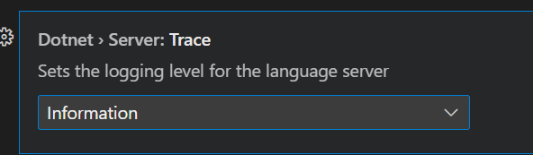
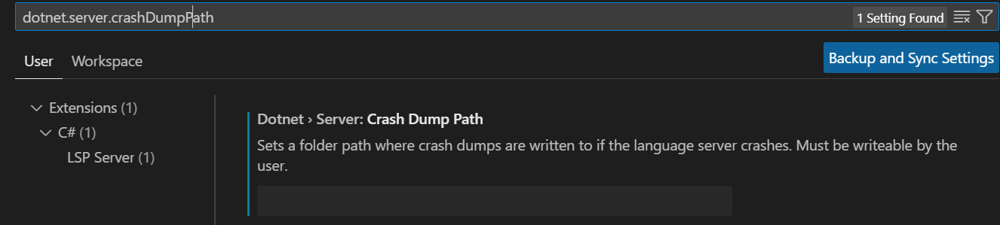

# Support

## How to get help

This project uses GitHub Issues to track bugs and feature requests. Please search the [existing issues](https://github.com/dotnet/vscode-csharp/issues) before filing new issues to avoid duplicates. For new issues, file your bug or feature request as a new Issue.

This repository tracks issues related to the C# extension.  Any issues related to the C# editing experience, Roslyn language server and other basic C# functionality should be filed here (regardless of if you're using C# Dev Kit or not).

For C# Dev Kit only features such as the Solution Explorer, Test Window, etc, please see https://github.com/microsoft/vscode-dotnettools/blob/main/SUPPORT.md

For help and questions about using this project, please see the [README](https://github.com/dotnet/vscode-csharp/blob/main/README.md).

### How to file an issue

We highly recommend using the C# extension's built-in command, `CSharp: Report an issue` (`csharp.reportIssue`) to create a pre-filled issue template.  This will include helpful details such as local dotnet installations, installed extensions, and other information.

#### Collecting general logs

The template has a section to include the `C#` output window logs.  These logs are not automatically included as they may contain personal information (such as full file paths and project names), but they are key to resolving problems.  

1.  First, set `dotnet.server.trace` to `Trace` in VSCode settings
    
2.  Reload the window via the `Developer: Reload Window` (`workbench.action.reloadWindow`) command
3.  Reproduce the issue
4.  Open the output window via `View` -> `Output` and change to the `C#` output window.
5.  Select all (e.g. cntrl+a) and copy paste into the issue template under the 'C# Log' section.  If you need to redact file paths and other information, please do so at this time.
6.  Once the logs are collected, reset `dotnet.server.trace` back to `Information`

Oftentimes the C# logs are enough, but sometimes when dealing with LSP server issues, the LSP trace logs are required.  These can be found by following the same steps as above, but using the `C# LSP Trace Logs` output window instead.

#### Project loading problems

A common cause of missing language features is a failure to load the project(s) or solution.  There can be a number of reasons why this happens, and some additional information is generally necessary to figure out what is going wrong.

First, providing the information from the issue template and the general logs (see above section) is almost always necessary.  After that there are a couple things to check:

1.  Is the file found in the correct project by the language server?  This information is displayed in the bottom right corner of the VSCode window in the language status section.  This item can be pinned using the pin icon so that it is always displayed.

    
2.  If using C# Dev Kit, check that the Solution Explorer displays the project with the expected references.  If not as expected, please also provide the contents of the `Projects` output window in the issue.

#### Colorization problems

For issues related to classification (colorizing the document), please provide the following
1.  Which theme is currently being used
2.  A screenshot of the `Developer: Inspect Editor Tokens and Scopes` (`editor.action.inspectTMScopes`) command output on the incorrect word

#### Diagnostics problems

For issues with diagnostics, please provide values of the background analysis scope options, `dotnet.backgroundAnalysis.analyzerDiagnosticsScope` and `dotnet.backgroundAnalysis.compilerDiagnosticsScope`

#### Language server crashing

As before, the general log collection is usually useful.  However we're not always able to diagnose just from the logs.  In that case a crash dump is useful.  This can be collected by setting the `dotnet.server.crashDumpPath` VSCode setting to a user-writeable folder.

When the server crashes, this should create a crash dump for it.

> [!WARNING]
> The dump can contain detailed information on the project - generally we will provide an email so that it can be shared privately

## Microsoft Support Policy

Support for this project is limited to the resources listed above.
