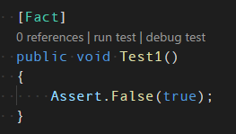

The C# extension currently supports running and debugging a unit test via CodeLens annotations on test methods. Just click the 'run test' or 'debug test' links:



### Notes

* Because `dotnet test` will run the test code in a child process, it isn't possible to configure a "unit test debugging" configuration in launch.json
* There currently isn't a VS Code command to run the current test, though there is an [issue for this in the backlog](https://github.com/dotnet/vscode-csharp/issues/421).
* You can tweak [debugging options](../debugger-launchjson.md) for unit tests by opening your VS Code settings file (ex: File->Preferences->Settings on Windows), and configuring the `"csharp.unitTestDebuggingOptions"` setting. See example below.
* If your unit tests are targeting .NET Framework instead of .NET Core, see [Desktop .NET Framework](./debugger/Desktop-.NET-Framework.md) for more information.

Example User Settings file with unit test debugging options:

```json
{
    "window.zoomLevel": 0,
    "csharp.unitTestDebuggingOptions": {
        "sourceFileMap": {
            "c:\\example\\folder\\where\\library\\was\\built": "/folder/where/my/library/is/now"
        }
    }
}
```
