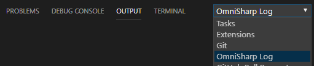

The extension supports the command that populates the necessary information from the user's system into a new github issue and opens the preview in the user's default browser to preview and submit.

#### Report issue on GitHub
* In VSCode, navigate to the View --> Command Palette menu or press Ctrl+Shift+P.
* Select the option : `CSharp: Start authoring a new issue on GitHub`. This will open the github repository issues page with a new issue with all the necessary system information. 
* Fill in all the fields like "Expected Behavior", "Actual Behavior", "Steps to Reproduce".
* Paste the "OmniSharp log" and the "C#" log (if any) and hit "Submit"

    ##### OmniSharp and C# log
    * In VSCode, navigate to View-->Output or press Ctrl+Shift+U
    * In the output pane on the right, you should see an "OmniSharp log" in the drop-down
    * Paste the output from here to the "OmniSharp log" section

    
    * The C# log can also be found in the same window.
