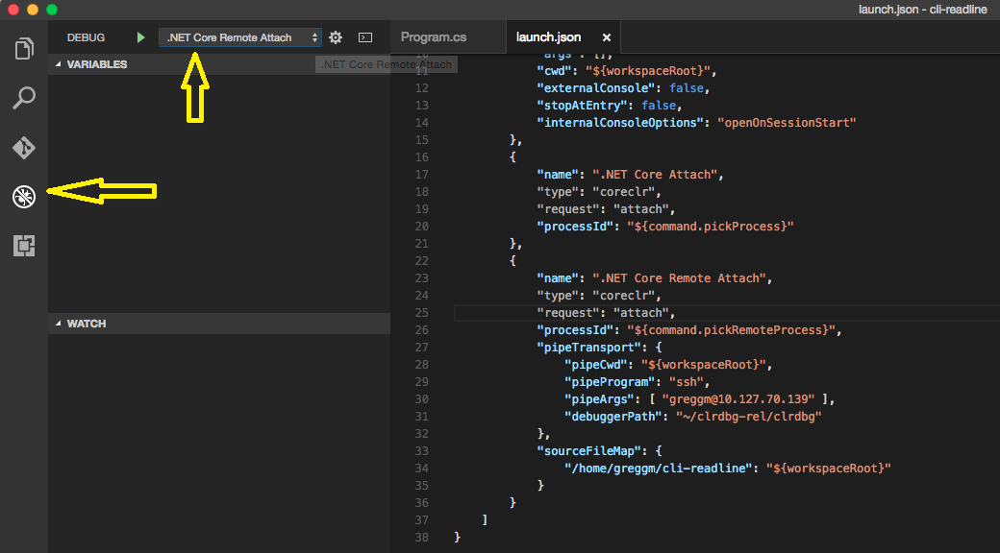

The C# extension supports attaching to processes running on remote machines/containers. It does so in a flexible way that only requires a transport program (example:  `ssh`, `docker exec`, `kubectl exec`, etc) which can prove a remote unix-like shell to the target system.

Note that while this page gives instructions for attach, it is also to launch a remote process. See the [[Remote Debugging On Linux-Arm]] page for examples.

### Setting up SSH

In this section, we will walk through the steps for configuring SSH. If you are using Docker or some other transport, you can skip this.

#### Visual Studio Code (client) machine setup

There is no way to pop up credential UI with VS Code, so we need a scriptable way to authenticate. One option is to provide the password on the command line, but obviously there are some security concerns with passing an unencrypted password around so much. A more secure option is to use SSH keys. To do this, open a bash prompt and run the following commands (note: if you are on Windows you can find better instructions [here](https://github.com/Microsoft/MIEngine/wiki/Offroad-Debugging-of-.NET-Core-on-Linux---OSX-from-Visual-Studio#ssh)). Since you want to store your key file without a password, make sure to keep it in a secure location.

```
mkdir ~/.ssh
chmod 700 ~/.ssh
ssh-keygen -t rsa
```

#### Target machine (server) setup

If you don't already have SSH installed on your server. The first step is obviously to install it. For example, on Ubuntu you can do that by running: `sudo apt-get install openssh-server`.

After SSH is installed, you want to add the public key generated in the last step (id_rsa.pub) to the list of keys in ~/.ssh/authorized_keys file on your server. If your computer has the ssh-copy-id command, the easy way is to run `ssh-copy-id ExampleAccount@ExampleTargetComputer`. Alternatively, you can copy the id_rsa.pub file to the server and then run `cat id_rsa.pub >> ~/.ssh/authorized_keys`.

#### Test your connection

Now that your client and server are configured, it is time to verify your connection works. To do this, open a terminal and type something like:

```
ssh ExampleAccount@ExampleTargetComputer echo "Hello World"
```

(Where ExampleAccount and ExampleTargetComputer should be replaced with appropriate values)

### Installing VSDBG on the server

As the last server setup step, we need to download VSDBG (the .NET Core command line debugger) onto the server. The easiest way to do this is by running the following command. Replace '~/vsdbg' with wherever you want VSDBG installed to.

`curl -sSL https://aka.ms/getvsdbgsh | /bin/sh /dev/stdin -v latest -l ~/vsdbg`

##### Using wget
If you are on a system that uses wget instead of curl, here is the wget equivalent:

`wget https://aka.ms/getvsdbgsh -O - 2>/dev/null | /bin/sh /dev/stdin -v latest -l ~/vsdbg`

##### Using PowerShell
If you want to download vsdbg on Windows and then copy it to your Linux/Mac computer/container, you can use the .ps1 script with this one-liner. Other supported `RuntimeID` values are `linux-musl-x64`, `linux-arm` and `osx`.

`powershell -NoProfile -ExecutionPolicy RemoteSigned -Command "[Net.ServicePointManager]::SecurityProtocol = [Net.SecurityProtocolType]::Tls12; &([scriptblock]::Create((Invoke-WebRequest -useb 'https://aka.ms/getvsdbgps1')))  -Version latest -RuntimeID linux-x64 -InstallPath c:\vsdbg\linux-x64"`

### Configuring SSH attach with launch.json

Now that we have our target machine ready to go, its time to configure your project. Open up .vscode/launch.json in VS Code, and add a new configuration to the end similar to the following:

```json
        {
            "name": ".NET Core SSH Attach",
            "type": "coreclr",
            "request": "attach",
            "processId": "${command:pickRemoteProcess}",
            "pipeTransport": {
                "pipeProgram": "ssh",
                "pipeArgs": [ "-T", "ExampleAccount@ExampleTargetComputer" ],
                "debuggerPath": "~/vsdbg/vsdbg",
                "pipeCwd": "${workspaceRoot}",
                "quoteArgs": true
            },
            "sourceFileMap": {
                "/home/ExampleAccount/ExampleProject": "${workspaceRoot}"
            }
        }
```

Here is what these options do:
* `processId`: 'command:pickRemoteProcess' instructs Visual Studio code to bring up UI to select the process to attach to. You can also replace this with the process id of the process you would like to debug if for some reason you don't like the selection UI.
* `pipeTransport.pipeProgram`: This an the executable which should be launched to provide a connection to the target computer. In this example we are using SSH, so this is the path to ssh client command.
* `pipeTransport.pipeArgs`: This is any arguments to pass to the pipe program. For the SSH client library we need to provide the computer to connect to. To use SSH, replace ExampleAccount/ExampleTargetComputer with appropriate values. Note that you can use the value `${debuggerCommand}` if you need to place the command line of the debugger program someplace other than the end of this command line.
* `pipeTransport.debuggerPath`: This is the path to where VSDBG is running on the target computer.
* `sourceFileMap`: To debug programs built on computers other than the Visual Studio code computer, Visual Studio code needs to be hold how to map file paths. So, for example, if you are debugging 'ExampleProject' which was built in your home directory on the Linux server, and now you have the same code open in Visual Studio code, this rule tells the debugger to change any file paths that it sees in '/home/ExampleAccount/ExampleProject' and replace it with the open directory.
* `quoteArgs`: Should arguments that contain characters that need to be quoted (example: spaces) be quoted? Defaults to 'true'. If set to false, the debugger command will no longer be automatically quoted.

Once this is all setup, then switch to the debug tab in VS Code, open the configuration drop down and select your new configuration ('.NET Core Remote Attach'). You may need to restart VS Code to have your new configuration show up in the list.



Once the configuration is selected. Press the play button (F5) to bring up the process selection UI and start debugging.

### Building and deploying the application and PDBs

Last, to be able to debug obviously the application must somehow be runnable on the target box. For this you can either build the application on the target server, or build the application somewhere else and then deploy it (see [.NET Core documentation](https://docs.microsoft.com/en-us/dotnet/articles/core/deploying/index) for more information).

There are two special concerns in this area when it comes to debugging:

1. Debug vs. Release Configuration: If you are going to be debugging, the experience is going to be much better if the debug configuration of your application is running instead of the release configuration. If this isn't possible, one can debug release code. To do this, disable [justMyCode](https://github.com/dotnet/vscode-csharp/blob/release/debugger.md#just-my-code) in launch.json.
2. PDB files: In order for VSDBG to be able to be able to map executable code back to its source code (or vice versa) VSDBG needs to have PDB files. If you are already building your application on the target server, this is taken care of for you. If you are building it somewhere else, you need to make sure to copy the PDB files next to their associated dll or set the DebugType to 'embedded' so that the PDB data is kept inside of the compiled dll.

### Configuring Docker attach with launch.json

If you are using Docker instead of SSH, here is what your launch.json might look like:

```json
        {
            "name": ".NET Core Docker Attach",
            "type": "coreclr",
            "request": "attach",
            "processId": "${command:pickRemoteProcess}",
            "pipeTransport": {
                "pipeProgram": "docker",
                "pipeArgs": [ "exec", "-i", "my_container_name" ],
                "debuggerPath": "/root/vsdbg/vsdbg",
                "pipeCwd": "${workspaceRoot}",
                "quoteArgs": false
            },
            "sourceFileMap": {
                "/home/ExampleAccount/ExampleProject": "${workspaceRoot}"
            }
        }
```

Here are additional notes about what these options are doing (see the SSH instructions for more information):
* `processId`: Just like for SSH, 'command:pickRemoteProcess' instructs Visual Studio code to bring up UI to select the process to attach to. This requires your container to have `ps`. If it doesn't, you can install it (on most distros using the 'procps' package), or you change this to a process id if you know what you want to debug. Alpine based containers do have ps, but the default version doesn't handle the required arguments, so you will need to install procps, with something like: RUN apk --no-cache add procps.
* `pipeTransport.pipeArgs`: Docker requires the name of the container to execute in, so make sure to replace `my_container_name` what what you really want.
* `pipeTransport.debuggerPath`: This is the path to where VSDBG is running on the target container. You can either change your container's build instructions to always include a version of vsdbg, or you can shell into the container before you start debugging to download it (example: `docker exec -it my_container_name /bin/sh`). See [Installing VSDBG on the server](#installing-vsdbg-on-the-server) for more information.
* `sourceFileMap`: To debug programs built on computers other than the Visual Studio code computer, Visual Studio code needs to be hold how to map file paths. So, for example, if you are debugging 'ExampleProject' which was built in your home directory on the Linux server, and now you have the same code open in Visual Studio code, this rule tells the debugger to change any file paths that it sees in '/home/ExampleAccount/ExampleProject' and replace it with the open directory.
* `quoteArgs`: The Docker CLI does NOT expect the command line for vsdbg to be quoted, so set this to `false`.

## Troubleshooting

### Enable Logging

#### Visual Studio
From View -> Other Windows -> Command Window, type ```DebugAdapterHost.Logging /On /OutputWindow to have logs appear in the Output Window.

#### VsCode
Logging can be enabled by adding the following to your launch.json configuration:
```javascript
"logging": {
   "engineLogging": true
}
```

### Known Errors

### Pipe program exited unexpectedly

If remote debugging is failing with an error message such as:

    "The pipe program '<insert-pipe-program-name-here>' exited unexpectedly with code 1."

Then there are a few possibilities as to what is going on:
* Something may be incorrectly configured with the transport. Read more of the log to try and understand what this could be. Also try re-running your transport command to test your connection -- copy your pipeProgram/args to a terminal and have your pipe program execute something like `echo Hello World` to see if it working.
* If the target process is running in a Docker container, this could indicate that the container shutdown. For example because the additional memory used by the debugger caused the container to hit its memory limit.
* This could also indicate that vsdbg running in the container is crashing or being aborted. You can confirm or deny this by modifying the transport command line to run a script that would run vsdbg and then output vsdbg's exit code. For some transports, you may also be able to do this by just modifying `pipeArgs`, for example, add an arg of: `"${debuggerCommand}; echo \"vsdbg exited with code: $?\""`

If vsdbg is crashing or being aborted a few additional troubleshooting steps:

#### 1: Check for libicu compatibility

See the [Testing libicu compatibility on Linux](https://github.com/dotnet/vscode-csharp/wiki/Testing-libicu-compatibility-on-Linux) page for more information.

#### 2: Save a coredump of a possible vsdbg crash

Another possible reason for the transport aborting is that vsdbg is crashing. To see if this is the problem and investigate why if it is, you can follow these steps.

First, on the target computer, set /proc/sys/kernel/core_pattern is set to something valid. For example:

```
mkdir ~/crash_reports
cd ~/crash_reports
cp /proc/sys/kernel/core_pattern core_pattern.bak
sudo sh -c 'echo "$(pwd)/%e-%p.cor" > /proc/sys/kernel/core_pattern'
```
More information on core_pattern can be found on [kernel.org](http://www.kernel.org/doc/Documentation/sysctl/kernel.txt).

After core_pattern is configured, you then want to change your launch.json configuration to set `ulimit -c unlimited` before starting vsdbg. This can be done by adding `"ulimit -c unlimited && ${debuggerCommand}"` as another argument in `pipeArgs` in your launch.json file.

Example:
```
    "pipeArgs": [ "-T", "ExampleAccount@ExampleTargetComputer", "ulimit -c unlimited && ${debuggerCommand}" ],
```

If all goes well this should result in a coredump being written to ~/crash_reports. You can then take a look at the coredump yourself using gdb, or share it with the debugger team.

#### Developer Mode not Enabled on macOS
If the process failed to attach and there is a similar event to the following:
```javascript
{
   "event":"output",
   "body": {
   "category":"telemetry",
   "output":"VS/Diagnostics/Debugger/vsdbg/AttachFailed",
   "data":{
      "VS.Diagnostics.Debugger.vsdbg.OSFamily":"Darwin",
      "VS.Diagnostics.Debugger.vsdbg.ErrorCode":-2147024809
}
```

and if you are on VsCode, you should see the stderr message:
``` vmmap[6174]: [fatal] unable to ask for permission to examine process; run tool using sudo, or without redirecting stdin and stderr. ```

Most likely that Developer Mode is not enabled on your mac machine. You can enable it by typing ```sudo DevToolsSecurity --enable```
